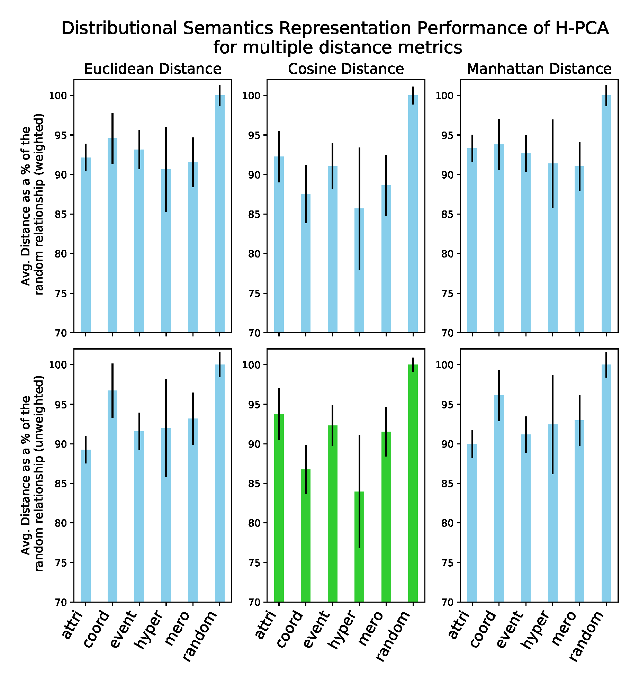
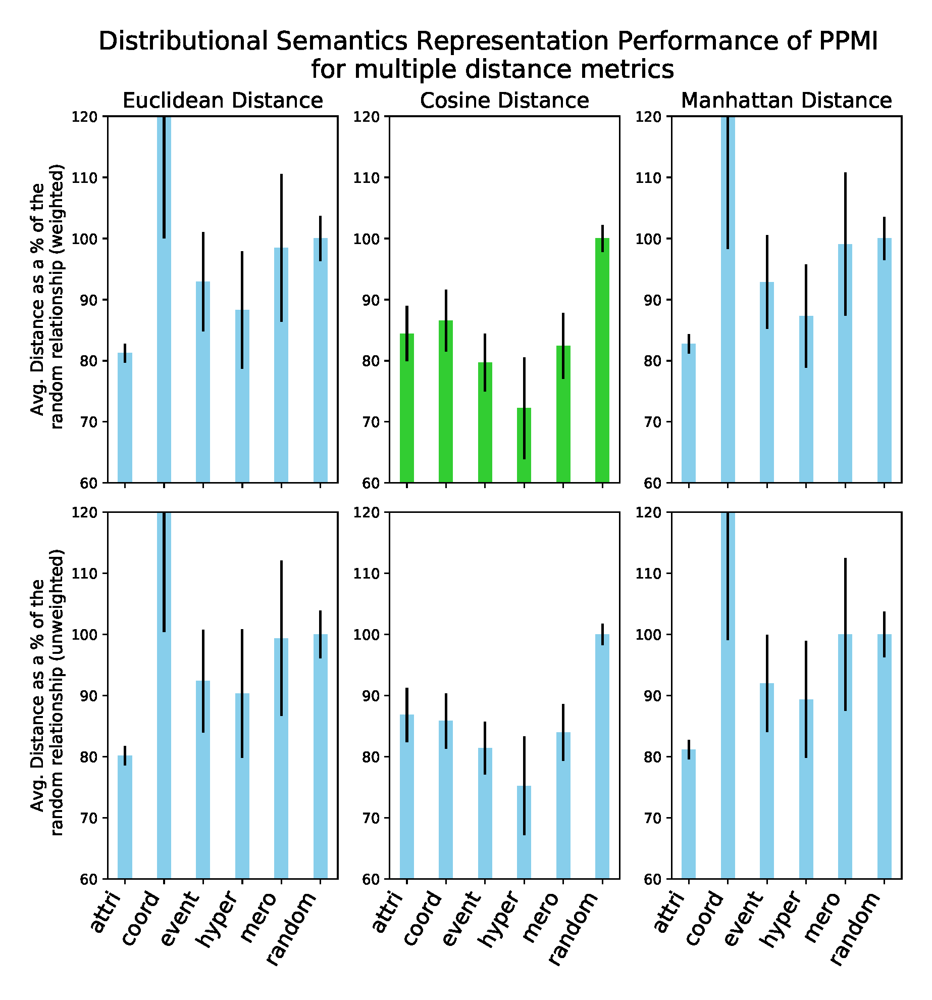
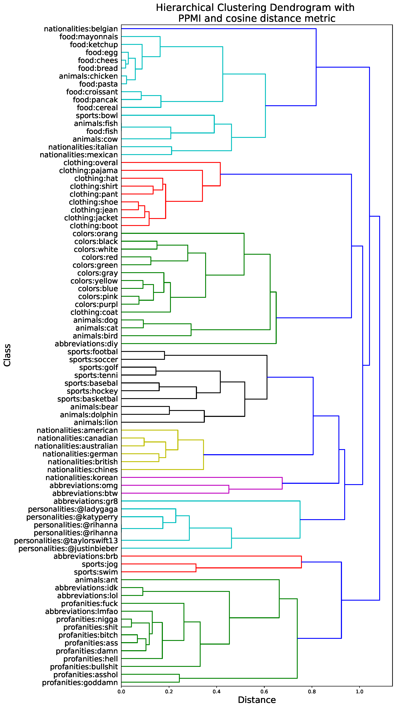

# Exploring distributional similarity in Twitter by using multiple word embedding methods
In this prject we compare and evaluate two simple embedding models which can be constructed directly from a given co-occurrence matrix extracted from Twitter data; Positive Pointwise Mutual Information (PPMI), and Hellinger Principal Component Analysis (H-PCA). For each embedding model we consider three alternative metrics for word similarity: cosine, euclidean and manhattan distance. 

Then, taking each combination of embedding model and similarity measure, we report results of two intrinsic evaluation measures, word similarity and concept categorization, on goldstandard datasets. We then qualitatively compare hierarchicalclustering dendrograms produced by the two most promising methods on sets of concept-categorized words, finding that the resulting dendrograms reproduce sensible semantic segmentations under both embedding types. [click here](https://github.com/federicoarenasl/Evaluating-w-Embeddings/blob/main/Evaluating_Word_Embbeddings.pdf) for the full project report.

## The Twitter dataset
All of these experiments will be done on the benchmark balanced EMNIST dataset [(Cohen et al., 2017)](https://arxiv.org/pdf/1702.05373.pdf). This dataset contains 131,600 28x28 px images of 47 different handwritten digits. The training set counts with 100,000 images, the validation set counts 15,800 images, and the test set counts with 15,800 images. At each experiment, the networks will be fed the training set, validated and fine-tuned in the validation set, and the best network will be evaluated on the test set. More on this [here](https://www.nist.gov/itl/products-and-services/emnist-dataset).

## Structure of the post
  - Evaluation_of_Regularisation_Techniques.pdf : This file represents the main file of the post, and we strongly encourage the reader to start by giving it a quick read to understand the project better. If the reader is still curios as to _how_ the results in the study were obtained, we encourage the reader to checkout the next two files.
  - Training-w-mlp-framework.md : this file, accompanied by its ```.ipynb``` version in the ```notebooks``` folder, will walk the reader through the bulding of the Neural Network architectures and the training of these networks with Dropout, L1 Regularisation, and L2 Regularisation. It will also include the hyperparameter search for the best model, and the training and testing of it.
  - Training-Results-Visualizer.mp : this file, accompanied by its ```.ipynb``` version in the ```notebooks``` folder, will go through the plotting and brief analysis of the training results, as well as reporting the test results from the last best model.
 
 ## A sneak peak at some results
Our first network, purposedly designed to show bad generalization performance is a Network for 100 Epochs, using Stocahstic Gradient Descent and Adam optimizer with a mini-batch size of 100, with one Affine Layer composed of 100 Hidden Units followed by a ReLu non-linearity, with learnng rate of 0.001 and all biases and weights initialised to 0. The generalization problem is evident as illustrated by the following figure.

<p align="center">


</p>

After a thorough hyperparameter search, we are able to find a model that, solely with regularisation, (1) greatly lower the Train/Test Error Gap from a 1.42 to a 0.13 Gap. Lower the Train/Test Accuracy Gap which went from a 14% to a 3.57% Accuracy Gap. Additionally, (2) we were able to increase the Test Accuracy from 81.4% to 84.03%. The Final Model is able to stably converge to a local minimum after 15 Epochs of training:

<p align="center">


</p>
